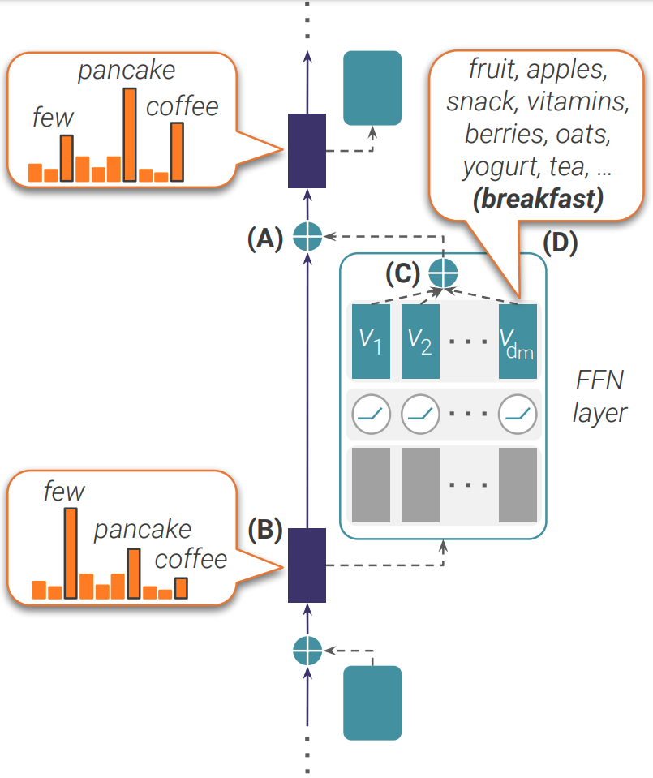

# Transformer Feed-Forward Layers Build Predictions by Promoting Concepts in the Vocabulary Space
This repository includes the accompanying code for the paper "[Transformer Feed-Forward Layers Build Predictions by Promoting Concepts in the Vocabulary Space
](https://arxiv.org/abs/2203.14680)". Mor Geva*, Avi Caciularu*, Kevin Ro Wang, and Yoav Goldberg.

In this repository, we provide the main scripts and notebooks used to reproduce our experiments.

<p align="center"></p>

## Structure
The repository contains:
* Code for generating the dataframe, based on the WikiText corpus, which served us during the experiments (in `data_generation` dir).
* Code for generating the values' projections (in `values_projections` dir).
* Code for generating the values' clusters (in `clustering` dir).
* Code for reproducing the toxic language suppression results (in `toxic_language_suppression` dir).
* Code for reproducing the early exit results (in `early_exit` dir).

For additional data or code please contact [Avi](https://aviclu.github.io/), [Mor](https://mega002.github.io/) or [Kevin](https://kevinrowang.com/).


### Citation
If you find our work useful, please cite the paper as:
```bibtex
@article{geva2022transformer,
      title={Transformer Feed-Forward Layers Build Predictions by Promoting Concepts in the Vocabulary Space},
      author={Geva, Mor and Caciularu, Avi and Wang, Kevin Ro and Goldberg, Yoav},
      journal={arXiv preprint arXiv:2203.14680},
      year={2022},
}
```
